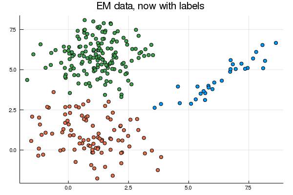

```{r setup, include=FALSE}
knitr::opts_chunk$set(echo = TRUE, cache = TRUE)
```

The text above is based on the Coursera course named "Bayesian Methods
in Machine Learning" (available at `ttps://www.coursera.org/learn/bayesian-methods-in-machine-learning/`) and
the references. 

# Introduction 

In this assignment, we will derive and implement formulas for the
Gaussian Mixture Model — one of the most commonly used methods for 
performing soft clustering of the data. We will use here samples from a 
Gaussian mixture model with unknown mean, variance, and priors. 
We also added initial values of parameters for grading purposes. 

The code below reads the data and shows the plot. 

```{python, engine.path = "/Users/brunawundervald/anaconda3/bin/python3"}
# Loading packages
import numpy as np                                    # maths in general 
from numpy.linalg import slogdet, det, solve           # matrix operations
import matplotlib.pyplot as plt                        # plotting
from scipy.stats import multivariate_normal as dmvnorm # multiv. normal
```


```{python, engine.path = "/Users/brunawundervald/.conda/envs/py38/bin/python", results='hide', fig.width=3, fig.height=3, fig.align='center'}
# Reading data 
samples = np.load('samples.npz')
X = samples['data']          # 2 columns of data to be clustered
pi0 = samples['pi0']         # The priors for the mixture proportions
mu0 = samples['mu0']         # The start values for \mu_c 
sigma0 = samples['sigma0']   # Covariance matrix between the clusters

plt.clf() # clean plot environment x
plt.figure(1)
plt.figure(figsize = (14, 10))
plt.scatter(X[:, 0], X[:, 1], c = 'orange', s = 30)
plt.axis('equal')
plt.show()
```


The EM algorithm is a coordinate descent optimization of the variational 
lower bound $\mathcal{L}(\theta, q) = \int q(T) \log\frac{p(X, T|\theta)}{q(T)}dT\to \max$.

<b>E-step</b>:<br>
$\mathcal{L}(\theta, q) \to \max\limits_{q} \Leftrightarrow \mathcal{KL} [q(T) \,\|\, p(T|X, \theta)] \to \min \limits_{q\in Q} \Rightarrow q(T) = p(T|X, \theta)$<br>

<b>M-step</b>:<br> 
$\mathcal{L}(\theta, q) \to \max\limits_{\theta} \Leftrightarrow \mathbb{E}_{q(T)}\log p(X,T | \theta) \to \max\limits_{\theta}$

For GMM, $\theta$ is a set of parameters that consists of mean vectors 
$\mu_c$, covariance matrices $\Sigma_c$ and priors $\pi_c$ for each component. The latent variables $T$ are indices of components to which each data point 
is assigned, i.e. $t_i$  is the cluster index for object $x_i$. The joint distribution of everything can be written as follows: 

$$\log p(T, X \mid \theta) =  \sum\limits_{i=1}^N \log p(t_i, x_i \mid \theta) = \sum\limits_{i=1}^N \sum\limits_{c=1}^C q(t_i = c) \log \left (\pi_c \, f_{\!\mathcal{N}}(x_i \mid \mu_c, \Sigma_c)\right),$$

where $f_{\!\mathcal{N}}(x \mid \mu_c, \Sigma_c) = \frac{1}{\sqrt{(2\pi)^n|\boldsymbol\Sigma_c|}}
\exp\left(-\frac{1}{2}({x}-{\mu_c})^T{\boldsymbol\Sigma_c}^{-1}({x}-{\mu_c})
\right)$ is the probability density function (pdf) of the normal distribution $\mathcal{N}(x_i \mid \mu_c, \Sigma_c)$.


# EM for GMMs

Consider $z_i = 1,\dots,k$ as the latent variable to be estimated 
(minor change of notation).We will add more details about the
EM algorithm now. We define the 
**expected complete data log likelihood** as
$$ Q(\mathbf{\theta}, \mathbf{\theta^{t-1}}) = \mathop{\mathbb{E}}[l_c(\mathbf{\theta}) | \mathcal{D}, \mathbf{\theta^{t-1}}]$$
where $t$ is the current iteration number. $Q$ is the auxiliary
function, and the expectation is taken w.r.t the old parameters and
the data $\mathcal{D}$. 

  - E-Step: computes $Q(\mathbf{\theta}, \mathbf{\theta^{t-1}})$, or the terms inside of it which the MLE depends on (expected sufficient statistics);  
  - M-Step: optimize the Q function w.r.t $\mathbf{\theta}$, or

$$\theta^t = \underset{\theta}{\mathrm{argmax}} Q(\mathbf{\theta}, \mathbf{\theta^{t-1}})$$
      
For the GMMs, the auxiliary function is written as

\begin{equation} 
\begin{split}
Q(\mathbf{\theta}, \mathbf{\theta^{t-1}}) 
& = \mathop{\mathbb{E}} \Big[ \sum_i log\thinspace p(\mathbf{x}_i, z_i | \mathbf{\theta})  \Big] \\
& = \mathop{\mathbb{E}} \Big[ \sum_i log\thinspace \Big[
\prod_{k=1}^{K}(\pi_k p(\mathbf{x}_i| \mathbf{\theta}_k))^{\mathop{\mathbb{I}}(z_i = k)}
\Big] \\
& = \sum_i \sum_k \mathop{\mathbb{E}}[\mathop{\mathbb{I}}(z_i = k)]
log[\pi_k p(\mathbf{x}_i| \mathbf{\theta}_k)] \\
& =  \sum_i \sum_k  p(z_i = k | \mathbf{x}_i,  \mathbf{\theta}^{t-1})
log[\pi_k p(\mathbf{x}_i| \mathbf{\theta}_k)]
\end{split}
\end{equation}

where $p(z_i = k | \mathbf{x}_i, \mathbf{\theta}^{t-1})$ is the 
'responsability' that cluster *k* takes for the *i*-th observation. 

The E-Step will compute:
$$ p(z_i = k | \mathbf{x}_i, \mathbf{\theta}^{t-1}) = 
\frac{\pi_k p(\mathbf{x}_i| \mathbf{\theta}_{k}^{(t-1)})}{
\sum_{k'} \pi_{k'} p(\mathbf{x}_i| \mathbf{\theta}_{k'}^{(t-1)})
}$$

The M-Step will compute:

$$ \pi_k = \frac{\sum_i p(z_i = k | \mathbf{x}_i, \mathbf{\theta}^{t-1})}{N}, $$

which basically describes the weighted number of points assigned 
to cluster $k$. It will also compute the MLE for $\mathbf{\mu}_k$
and $\mathbf{\Sigma}_k$, or

\begin{equation}
\begin{split}
l(\mathbf{\mu}_k, \mathbf{\Sigma}_k) 
& = \sum_k \sum_i  p(z_i = k | \mathbf{x}_i,  \mathbf{\theta}^{t-1})
log p(\mathbf{x}_i| \mathbf{\theta}_k)
\\
& = -\frac{1}{2} \sum_i  p(z_i = k | \mathbf{x}_i,  \mathbf{\theta}^{t-1}) [log
|\mathbf{\Sigma}_k| + (\mathbf{x}_i - \mathbf{\mu}_k)^{T}
\mathbf{\Sigma}_k^{-1} (\mathbf{x}_i - \mathbf{\mu}_k)]
\end{split}
\end{equation} 


(i) for $\mathbf{\mu_k}$:

\begin{equation} 
\begin{split}
\frac{\partial l(\mathbf{\mu}_k, \mathbf{\Sigma}_k) }{\partial \mathbf{\mu}_k}
& =  -\frac{1}{2} \sum_i  p(z_i = k | \mathbf{x}_i,  \mathbf{\theta}^{t-1})(2
\mathbf{\Sigma}_k^{-1} (\mathbf{x}_i - \mathbf{\mu}_k)) \\
& \text{By }\mathbf{\Sigma}_k^{-1} \text{being positive definite:}   \\
& =   - \sum_i  p(z_i = k | \mathbf{x}_i,  \mathbf{\theta}^{t-1})
(\mathbf{x}_i - \mathbf{\mu}_k)\\
& = - \sum_i  p(z_i = k | \mathbf{x}_i,  \mathbf{\theta}^{t-1})
\mathbf{x}_i + \sum_i  p(z_i = k | \mathbf{x}_i,  \mathbf{\theta}^{t-1}) \mathbf{\mu}_k \\
& \text{equaling to 0} \\
0 = &  - \sum_i  p(z_i = k | \mathbf{x}_i,  \mathbf{\theta}^{t-1})
\mathbf{x}_i +   p(\mathbf{z} = k | \mathbf{x}, \mathbf{\theta}^{t-1})  \mathbf{\mu}_k \\
\mathbf{\mu}_k  = & \frac{\sum_i  p(z_i = k | \mathbf{x}_i,  \mathbf{\theta}^{t-1}) \mathbf{x}_i}{ p(\mathbf{z} = k | \mathbf{x}, \mathbf{\theta}^{t-1})}
\end{split}
\end{equation} 


(i) for $\mathbf{\mathbf{\Sigma}_k}$:
\begin{equation} 
\begin{split}
\frac{\partial l(\mathbf{\mu}_k, \mathbf{\Sigma}_k) }{\partial \mathbf{\Sigma}_k)}
& = -\frac{1}{2} \sum_i  p(z_i = k | \mathbf{x}_i,  \mathbf{\theta}^{t-1})
(\mathbf{\Sigma}_k^{-1} - \mathbf{\Sigma}_k^{-1}(\mathbf{x}_i - \mathbf{\mu}_k)(\mathbf{x}_i - \mathbf{\mu}_k)^T \mathbf{\Sigma}_k^{-1}) \\
& \text{since } \frac{\partial log|\Sigma|}{\partial \Sigma} = \Sigma^{-1}\\
& \text{equaling to 0} \\
0 & = - \sum_i  p(z_i = k | \mathbf{x}_i,  \mathbf{\theta}^{t-1})
\mathbf{\Sigma}_k^{-1} + \sum_i  p(z_i = k | \mathbf{x}_i,  \mathbf{\theta}^{t-1})  \mathbf{\Sigma}_k^{-1} (\mathbf{x}_i - \mathbf{\mu}_k)(\mathbf{x}_i - \mathbf{\mu}_k)^T  \mathbf{\Sigma}_k^{-1} \\
\mathbf{\Sigma}_k & = \frac{ \sum_i  p(z_i = k | \mathbf{x}_i,  \mathbf{\theta}^{t-1})  (\mathbf{x}_i - \mathbf{\mu}_k)(\mathbf{x}_i - \mathbf{\mu}_k)^T}{p(\mathbf{z} = k | \mathbf{x}, \mathbf{\theta}^{t-1})} \\
\end{split}
\end{equation} 


```{python, engine.path = "/Users/brunawundervald/anaconda3/bin/python3"}
def E_step(X, pi, mu, sigma):
    """
    Performs E-step on GMM model
    Each input is numpy array:
    X: (N x d), data points
    pi: (C), mixture component weights 
    mu: (C x d), mixture component means
    sigma: (C x d x d), mixture component covariance matrices
    
    Returns:
    gamma: (N x C), probabilities of clusters for objects
    """
    N = X.shape[0] 
    C = pi.shape[0]
    d = mu.shape[1]
    gamma = np.zeros((N, C))
    for c in np.array(range(C)):        
        # Normalization constant of a biv. Normal distribution
        const = ((2 * 3.141592)**d * det(sigma[c]))**0.5
        # Subtracts mu's of the observations 
        x = np.subtract(X, mu[c]).transpose()
        # Calculating the core of the biv. Normal distribution
        # with the inverse of Sigma * X being found with
        # since (SS^-1 = I): 
        invSx = np.linalg.solve(sigma[c], x)
        xInvSx = -1/2 * np.multiply(x, invSx).sum(0)
        density = np.exp(xInvSx)/const
        # saving final values for all x with all the mu's
        gamma[:, c] = pi[c] * density
    gamma /= gamma.sum(1).reshape(N, 1)
    return gamma

```


Now it's time to reestimate the parameters

  
```{python, engine.path = "/Users/brunawundervald/anaconda3/bin/python3", results='hide'}
def M_step(X, gamma):
    """
    Performs M-step on GMM model
    Each input is numpy array:
    X: (N x d), data points
    gamma: (N x C), distribution q(T)  
    
    Returns:
    pi: (C)
    mu: (C x d)
    sigma: (C x d x d)
    """
    N = X.shape[0] # number of objects
    C = gamma.shape[1] # number of clusters
    d = X.shape[1] # dimension of each object
    pi = np.zeros((C))
    mu = np.zeros((C, d)) 
    sigma = np.zeros((C, d, d)) 
    gamma_sum = gamma.sum(0)
    # the new pi's are:
    pi = gamma_sum/N
    for c in np.array(range(C)):
        mu[c] = np.dot(gamma[:, c].transpose(), X)/gamma_sum[c]
        # # sum of probabilities * x/sum(probabilities)
        x = np.matrix(np.subtract(X, mu[c]))
        sigma[c] = (x.transpose() * np.diag(gamma[:, c]) * x)/gamma_sum[c]
        # 
        # mu_multp = mu[c] * mu[c].transpose()
        # x = np.matrix(X)
        # xpxt = (x.transpose() * np.diag(gamma[:, c]) * x)
        # norm_xpxt = xxt/gamma_sum[c]
        # sigma[c] = norm_xpxt - mu_multp/gamma_sum[c]
    return pi, mu, sigma

gamma_E = E_step(X, pi0, mu0, sigma0)    
pi, mu, sigma = M_step(X, gamma_E)    
```

The Jensen's inequality states that, for any convex function $f$

$$f \Big( \sum_{i=1}^{n} \lambda_i x_i \Big) \leq
\sum_{i=1}^{n} \lambda_i f(x_i), $$

where  $\lambda_i \geq 0$ and $\sum_{i=1}^{n} \lambda_i = 1$. Now,
considering any arbitrary distribution $q(\mathbf{z}_i)$ over 
the hidden variables, the likelihood is

$$ l(\mathbf{\theta}) = \sum_{i=1}^{N} log \Big[
\sum_{\mathbf{z}_i}  q(\mathbf{z}_i) 
\frac{p(\mathbf{x}_i, \mathbf{z}_i | \mathbf{\theta})}{q(\mathbf{z}_i) }\Big]$$

that can be shown to be bounded as 

$$ l(\mathbf{\theta}) \geq 
 \sum_{i=1}^{N} 
\sum_{\mathbf{z}_i}  q(\mathbf{z}_i) 
log \frac{p(\mathbf{x}_i, \mathbf{z}_i | \mathbf{\theta})}{q(\mathbf{z}_i) } $$


Finally, we need some function to track convergence. We will use 
the variational lower bound $\mathcal{L}$ for this purpose. We will
stop our EM iterations when $\mathcal{L}$ will saturate. Usually, 
you will need only about 10-20 iterations to converge. It is also
useful to check that this function never decreases during training. 


$$\mathcal{L} = \sum_{i=1}^{N} \sum_{c=1}^{C} q(t_i =c) (\log \pi_c + \log f_{\!\mathcal{N}}(x_i \mid \mu_c, \Sigma_c)) - \sum_{i=1}^{N} \sum_{c=1}^{K} q(t_i =c) \log q(t_i =c)$$


```{python, engine.path = "/Users/brunawundervald/anaconda3/bin/python3", results='hide'}
def compute_vlb(X, pi, mu, sigma, gamma):
    """
    Each input is numpy array:
    X: (N x d), data points
    gamma: (N x C), distribution q(T)  
    pi: (C)
    mu: (C x d)
    sigma: (C x d x d)
    
    Returns value of variational lower bound
    """
    N = X.shape[0] # number of objects
    C = gamma.shape[1] # number of clusters
    d = X.shape[1] # dimension of each object
    loss = 0
    for c in np.array(range(C)):
        for n in np.array(range(N)):
            # calculates log density of x | theta
            log_dmvnorm_c = dmvnorm.logpdf(X[n,:], mu[c], sigma[c])
            # increasing loss with the formula
            loss += gamma[n, c] * ((np.log(pi[c]) + log_dmvnorm_c) - np.log(gamma[n, c]))
    return loss

loss = compute_vlb(X, pi, mu, sigma, gamma_E)
```


Now that we have E step, M step and VLB, we can implement the training loop. 
We will initialize values of $\pi$, $\mu$ and $\Sigma$ to some random numbers, 
train until $\mathcal{L}$ stops changing, and return the resulting points. 
We also know that the EM algorithm converges to local optima. To find a 
better local optima, we will restart the algorithm multiple times from different 
(random) starting positions. Each training trial should stop either when maximum 
number of iterations is reached or when relative improvement is smaller than 
given tolerance ($|\frac{\mathcal{L}_i-\mathcal{L}_{i-1}}{\mathcal{L}_{i-1}}| \le \text{rtol}$).

Initial (random) values of $\pi$ that you generate must be 
non-negative and sum up to 1. Also, $\Sigma$ matrices must be symmetric 
and positive semi-definite. 


```{python, engine.path = "/Users/brunawundervald/anaconda3/bin/python3", results='hide'}
def train_EM(X, C, rtol = 1e-3, max_iter = 100, restarts = 10):
    '''
    Starts with random initialization *restarts* times
    Runs optimization until saturation with *rtol* reached
    or *max_iter* iterations were made.
    
    X: (N, d), data points
    C: int, number of clusters
    '''
    N = X.shape[0] # number of objects
    d = X.shape[1] # dimension of each object
    best_loss = -np.inf
    best_pi = None
    best_mu = None
    best_sigma = None
    for _ in range(restarts):
        try:
            pi = np.random.rand(C)
            pi = pi/pi.sum(0)
            mu = np.random.random_sample((C,d))
            sigma = np.array( [np.eye(d) for _ in range(C)])
            loss = -np.inf
            should_continue = True
            iteration = 0
            for _ in range(max_iter):
                former_loss = np.copy(loss)
                gamma = E_step(X, pi, mu, sigma)
                pi, mu, sigma = M_step(X, gamma)
                loss = compute_vlb(X, pi, mu, sigma, gamma)
                # checking that the loss actually improved (not a bug)
                if(former_loss > loss):
                    print("bug")
                # is the increase in the loss actually different from
                # the previous one?
                should_continue = np.abs(loss/former_loss - 1) > rtol
                if(should_continue == False):
                    break 
            # is the current loss better than -infinite? if yes, save the 
            # results
            if(loss > best_loss):
                best_loss = np.copy(loss)
                best_pi = pi
                best_mu = mu
                best_sigma = sigma
                print(best_loss)
        except np.linalg.LinAlgError:
            print("Singular matrix: components collapsed")
            pass
    return best_loss, best_pi, best_mu, best_sigma

best_loss, best_pi, best_mu, best_sigma = train_EM(X, 3, restarts = 20)
```


```{python, engine.path = "/Users/brunawundervald/anaconda3/bin/python3", results='hide', fig.width=3, fig.height=3, fig.align='center'}
plt.clf()
plt.figure(1)
plt.figure(figsize = (8, 7))
# Now, what is the E-step for the current optimal parameters?
gamma = E_step(X, best_pi, best_mu, best_sigma)
labels = gamma.argmax(1)
plt.scatter(X[:, 0], X[:, 1], c = labels, s = 30)
plt.axis('equal')
plt.show()
```


## `Julia` code

The code above is the same as the `python` one, but in `Julia`. The
files for the code can be found at: `https://github.com/brunaw/jubs/tree/master/code/ml`

```{r, eval = FALSE}
using Colors
using Plots
using DataFrames
using DelimitedFiles
using LinearAlgebra
using IterativeSolvers
using Distributions

# Data -------
samples = readdlm("samples.txt")
X = [[samples[setdiff(1:end, 1), 2]];
     [samples[setdiff(1:end, 1), 3]]]

pi = [0.34518140, 0.6066179 ,  0.04820071]    # The priors for the mixture proportions
mu = [[-0.7133619    0.90635089];
      [0.7662367   0.8260541];
      [ -1.3236828 -1.7524445]]               # The start values for \mu_c
sigma = cat(
       [1.004904 1.899802; 1.899802 4.183546],
       [1.9686781 0.7841534; 0.7841534 1.8331994],
       [0.1931634 -0.1164864; -0.1164864 1.9839597],
        dims = 3)   # Covariance matrix between the clusters

# Plotting -------
plot(X[1], X[2], seriestype=:scatter, label = "", title = "EM data")

# Main functions -------
#---------------------------------------------------------------
function E_step(X, pi, mu, sigma, C = 3)
    N = size(X[1])[1]
    d = size(mu)[2]
    gamma = zeros(Float64, N, C)
    x = zeros(Float64, N, d)

    for c in 1:C
        # Normalization constant of a biv. Normal distribution
        cst = ((2 * 3.141592)^d * det(sigma[:, :, c]))^0.5
        # Subtracts mu's of the observations
        for i in 1:d
            x[:, i] = [X[i] .- mu[c, i]][1]
        end
    # Calculating the core of the biv. Normal distribution
        xt = LinearAlgebra.transpose(x)[:, :]
        xinvSxt = x * inv(sigma[:, :, c]) .* x
        xinvSx = (sum(sum(xinvSxt, dims = 2), dims = N)) .* -1/2
        dens = exp.(xinvSx)/cst
        gamma[:, c] = pi[c] * dens
    end
    gamma_div = sum(gamma, dims = 2)
    final_gamma = gamma ./ gamma_div
    return final_gamma
end

#----------------------------------------------------------------
function M_step(X, gamma)
    N = size(X[1])[1] # number of objects
    C = size(gamma)[2] # number of clusters
    d = size(X)[1] # dimension of each object
    mu = zeros(Float64, C, d)
    sigma = zeros(Float64, d, d, C)
    gamma_sum = sum(gamma, dims=1)
    pi = gamma_sum/N
    x = zeros(Float64, N, d)

    for c in 1:C
        for m in 1:d
        mu[c, m] = sum(gamma[:, c] .* X[m, :][1])/gamma_sum[c]
        end
        for i in 1:d
            x[:, i] = [X[i] .- mu[c, i]][1]
        end
        sigma[:, :, c] = (transpose(x) * Diagonal(gamma[:, c]) * x)/gamma_sum[c]
    end
return pi, mu, sigma
end

#---------------------------------------------------------------------
function compute_vlb(X, _pi, mu, sigma, gamma, C = 3)
    N = size(X[1])[1]
    d = size(mu)[2]
    loss = zeros(Float64, 1)
    for c in 1:C
        for n in 1:N
            mv_norm = MvNormal(mu[c, :], Symmetric(sigma[:, :, c]))
            logd = logpdf(mv_norm, [X[1][n], X[2][n]])
            gamma_c = gamma[n, c]
            loss_here   = gamma_c * ((log(_pi[c]) + logd) - log(gamma_c))
            loss[1] = loss[1] + loss_here[1]
        end
    end
return loss
end

# Testing it
gamma = E_step(X, pi, mu, sigma)
pi, mu, sigma = M_step(X, gamma)
vlb = compute_vlb(X, pi, mu, sigma, gamma)
print(vlb)

#----------------------------------------------------------------
function train_EM(X, C, rtol = 1e-3, max_iter = 100, restarts = 25)

    N = size(X[1])[1] # number of objects
    d = size(mu)[2] # dimension of each object
    best_loss = -Inf
    best_pi = nothing
    best_mu = nothing
    best_sigma = nothing

    for _ in 1:restarts
            pi = rand(C)
            pi = pi/sum(pi)
            mu = reshape(randn(C * d), (C, d))
            sigma = zeros(Float64, (d, d, C))
            for c in 1:C
                sigma[:, :, c] = Diagonal(ones(d))
            end
            lloss = -Inf
            not_saturated = true
            iteration = 0
            while (not_saturated & (iteration < max_iter))
                former_loss = copy(lloss)
                gamma = E_step(X, pi, mu, sigma)
                pi, mu, sigma = M_step(X, gamma)
                lloss = compute_vlb(X, pi, mu, sigma, gamma)
                if(former_loss[1] > lloss[1])
                    print("bug")
                end
                not_saturated = abs((lloss[1]/former_loss[1]) - 1) > rtol
                iteration = iteration + 1
            end
            if(lloss[1] > best_loss[1])
                best_loss = copy(lloss)
               best_pi = pi
               best_mu = mu
               best_sigma = sigma
            end
    end
    return best_loss, best_pi, best_mu, best_sigma
end

# Training the model -------
best_loss, best_pi, best_mu, best_sigma = train_EM(X, 3)
gamma = E_step(X, best_pi, best_mu, best_sigma)

function indmaxC(x::AbstractArray)
    pos = zeros(Float64, size(x, 1))
    for c in 1:size(x, 1)
    pos[c] = findmax(x[c,:])[2]
    end
    return pos
end

labels = indmaxC(gamma)

plot(X[1], X[2], seriestype=:scatter, groups = labels,
label = "", title = "EM data, now with labels")
#-------------------------------------------------------------
```


```{r, out.height="70%", out.width="70%", fig.align='center', echo = FALSE}

```


## References

@murphy2012machine
@bezanson2017julia
@van2007python
